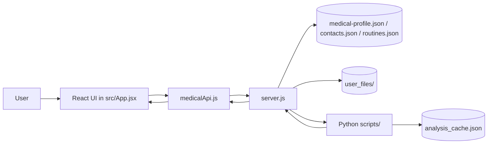

# Project Architecture

This project is a local-first medical and emergency helper app with three main layers:

1. A React frontend built with Vite.
2. A small Node.js server that exposes local APIs and serves files.
3. Python scripts that parse medical history, generate recommendations, and build charts.

The app stores state in JSON files and uploaded files on disk instead of using a database.

## High-Level Flow

## Runtime Architecture

### Frontend

The active frontend lives in [src/](src) and is the main app you run during development.

- [src/main.jsx](src/main.jsx) mounts the React app.
- [src/App.jsx](src/App.jsx) contains the main UI, tab logic, forms, charts, and state.
- [src/medicalApi.js](src/medicalApi.js) wraps all API calls so the UI stays clean.
- [src/exerciseCatalog.json](src/exerciseCatalog.json) provides exercise suggestions used by the routine UI.
- [index.html](index.html) is the Vite entry page for the React app.

The frontend handles:

- emergency contact display
- medical profile editing
- history file upload and note saving
- supplement recommendations
- routine management
- first-aid and disaster guidance
- trend chart rendering from extracted medical data

### Backend

The backend is [server.js](server.js). It listens on port `5501` and acts as the local API hub.

It is responsible for:

- serving the legacy static app when needed
- reading and writing [medical-profile.json](medical-profile.json)
- reading and writing [contacts.json](contacts.json)
- reading and writing [routines.json](routines.json)
- saving uploaded files into [user_files/](user_files)
- deleting saved history files
- calling Python analysis scripts
- returning cached or generated supplement/routine analysis

The frontend talks to the backend through `/api/...` routes, and [vite.config.js](vite.config.js) proxies those routes to `http://localhost:5501` during development.

### Python Layer

The Python code in [scripts/](scripts) does the medical-data processing.

- [scripts/lab_ingestion.py](scripts/lab_ingestion.py) extracts text from PDFs or text files, detects dates, finds lab values, and produces structured test records.
- [scripts/supplement_recommender.py](scripts/supplement_recommender.py) turns those records into supplement and routine suggestions, using OpenAI when configured and a fallback rule set otherwise.
- [scripts/routine_generator.py](scripts/routine_generator.py) converts recommendation output into a full day schedule.
- [scripts/plot_test_results.py](scripts/plot_test_results.py) generates a standalone PNG chart of trend data.
- [scripts/analysis_cache.py](scripts/analysis_cache.py) hashes relevant inputs and stores cached analysis.

The Node server runs these scripts with `spawnSync`, captures JSON output, and returns it to the frontend.

## AI Agent Style Data Flow

The project does not use a separate hosted agent service. Instead, the Python scripts behave like focused analysis agents with a clear input/output contract.

The actual server endpoints involved are:

- `GET /api/medical-profile` and `PUT /api/medical-profile` for the main profile.
- `POST /api/history-records` for saved uploads and notes.
- `DELETE /api/history-file` for deleting an uploaded file and its record.
- `GET /api/recommended-supplements` for analysis output.
- `GET /api/routines` and `PUT /api/routines` for saved routines.
- `POST /api/generate-routines` for AI-generated daily plans.
- `GET /api/contacts` and `PUT /api/contacts` for emergency contacts.

### 1. Frontend collects structured input

The React app gathers:

- medical profile fields
- uploaded report metadata
- notes and tags for a history item
- routine preferences
- contact records

That data is sent to [server.js](server.js) through the API layer in [src/medicalApi.js](src/medicalApi.js).

### 2. Node normalizes the request

Before Python is called, the server:

- stores profile/contact/routine data in JSON files
- writes uploaded files into [user_files/](user_files)
- converts file uploads into disk-backed records
- passes the profile path and project root into Python

This keeps Python focused on analysis instead of web-server concerns.

### 3. Python ingests the medical history

The main ingestion path is [scripts/lab_ingestion.py](scripts/lab_ingestion.py).

It performs these steps:

- loads [medical-profile.json](medical-profile.json)
- filters `historyRecords` by tags such as `blood-test`, `lipid-test`, and `cbc`
- extracts text from PDF or text files
- finds report dates
- scans the text for lab measurements
- maps metric aliases into normalized keys like `ldl`, `hdl`, `triglycerides`, and `hba1c`

The ingestion output is a normalized record list where each item keeps:

- `id` for the source history entry
- `title` for display
- `reportDate` and `uploadedAt` for timeline ordering
- `tags` for filtering test records
- `metrics` as a compact numeric map used by charts and recommendations
- `parserUsed` so the caller can see whether the text came from LlamaParse, PyPDF, or plain text
- `structuredMeasurements` for the full Pydantic-dumped measurement objects

The chart builder then converts those records into per-metric series, so the frontend can render historical trends without re-parsing raw files.

### 4. Pydantic provides the structured contract

The ingestion script uses Pydantic models as the schema boundary:

- `LabMeasurement` describes one extracted measurement.
- `LabReportIngestion` describes one parsed report.

These models make the output consistent even when the source reports are messy or partially parsed.

The important effect is that the rest of the pipeline receives structured Python objects instead of raw text.

That schema boundary matters because the downstream code only needs a few stable fields:

- metric key
- display label
- numeric value
- unit
- original source line

If a report is incomplete, Pydantic still gives the pipeline a predictable object shape, which keeps the recommendation logic and chart generation simple.

### 5. Analysis turns records into recommendations

The recommendation layer in [scripts/supplement_recommender.py](scripts/supplement_recommender.py) consumes the parsed records and produces a compact analysis payload.

Its behavior is:

- build `test_records` from the profile and uploaded files
- create chart series from the extracted values
- try OpenAI if `OPENAI_API_KEY` is set
- fall back to rule-based recommendations if the API is unavailable
- normalize recommendations into arrays of strings

The OpenAI path is intentionally narrow. The Python script sends only compressed history context, not raw files, and asks for strict JSON with:

- `supplements`
- `routines`
- `caution`
- `summary`

If the model call fails, the fallback path still produces usable guidance from the most recent metric values.

The result is JSON with fields like:

- `supplements`
- `routines`
- `caution`
- `summary`
- `chartSeries`
- `recordsConsidered`

### 6. Cache and reuse results

[scripts/analysis_cache.py](scripts/analysis_cache.py) computes a hash from:

- profile fields
- metadata for each history record
- the referenced uploaded files

If nothing important has changed, the previous analysis result is reused instead of recalculating it.

That cache key protects against unnecessary reruns when the user only switches tabs or reloads the page. It also means the server can serve the same analysis result to both the supplement view and the routine generator.

### 7. Frontend renders the analysis

The React app receives the final JSON payload and renders:

- trend charts
- supplement suggestions
- routine suggestions
- safety cautions

The same analysis object also feeds the routine-generation flow, where [scripts/routine_generator.py](scripts/routine_generator.py) combines baseline wellness blocks, supplement slots, and any AI-written routine items into a sorted daily schedule.

## AI Flow Summary

The practical pipeline is:

1. User uploads or edits medical information in the frontend.
2. The frontend sends that data to the Node server.
3. The server persists the data and calls Python.
4. Python extracts lab values and builds Pydantic-validated report objects.
5. The recommender converts those objects into advice, chart data, and a compact JSON payload.
6. The routine generator can reuse that payload to build a daily schedule.
7. The frontend displays the output and the server caches it for reuse.

## Data Contracts

The project works because each layer agrees on a small set of stable shapes.

### History record shape

Records in [medical-profile.json](medical-profile.json) are expected to carry fields like:

- `title`
- `uploadedAt`
- `fileName`
- `filePath`
- `mimeType`
- `notes`
- `tags`

Those fields are enough for the server to store the upload, for Python to find the file, and for the recommender to decide whether the record is relevant to lab analysis.

### Recommendation payload shape

The analysis output keeps a small response schema:

- `recordsConsidered`
- `recommendations`
- `chartSeries`
- `parsersUsed`
- `apiUsed`
- `apiError`
- `cached`
- `cacheTimestamp`
- `fileHash`

This makes the frontend rendering straightforward and keeps the API response stable even when the underlying analysis path changes.

### Routine payload shape

The routine generator emits a list of normalized routines with:

- `id`
- `name`
- `type`
- `startTime`
- `endTime`
- `description`
- `position`
- `source`

That shape matches the saved routines store in [routines.json](routines.json), so AI-generated and user-created routines can live together.

## Data Model

### `medical-profile.json`

This is the main medical record store. It keeps:

- patient blood group
- allergies
- conditions
- emergency doctor text
- medications
- uploaded history record metadata

History records point to actual files saved in [user_files/](user_files).

### `contacts.json`

This stores user-created emergency contacts.

### `routines.json`

This stores saved routines, including AI-generated ones.

### `analysis_cache.json`

This stores cached supplement-analysis results so the Python analysis does not rerun unnecessarily.

### `user_files/`

This folder holds uploaded PDFs, text notes, and generated artifacts.

## Legacy Path

The project still contains an older non-React implementation:

- [E1.html](E1.html) is the legacy standalone HTML app.
- [app.js](app.js) is the older JavaScript logic for that page.

This path appears to be kept for compatibility and historical reference, while the React/Vite app is the current primary frontend.

## File Responsibilities

### Root Config And Tooling

- [package.json](package.json) defines the frontend scripts and dependencies.
- [vite.config.js](vite.config.js) configures the React dev server and API proxy.
- [pyproject.toml](pyproject.toml) and [requirements.txt](requirements.txt) define Python dependencies.
- [readme.md](readme.md) documents setup and usage.

### Frontend Files

- [src/App.jsx](src/App.jsx): main UI and business logic.
- [src/main.jsx](src/main.jsx): React entry point.
- [src/medicalApi.js](src/medicalApi.js): API client and data normalization.

### Backend And Analysis Files

- [server.js](server.js): API server and file server.
- [scripts/lab_ingestion.py](scripts/lab_ingestion.py): report parsing and metric extraction.
- [scripts/supplement_recommender.py](scripts/supplement_recommender.py): supplement/routine analysis.
- [scripts/routine_generator.py](scripts/routine_generator.py): routine scheduling.
- [scripts/plot_test_results.py](scripts/plot_test_results.py): trend graph generation.
- [scripts/analysis_cache.py](scripts/analysis_cache.py): result caching.

### Stored Data

- [medical-profile.json](medical-profile.json): main profile data.
- [contacts.json](contacts.json): trusted contacts.
- [routines.json](routines.json): saved routines.
- [analysis_cache.json](analysis_cache.json): cached analysis.

## Important Design Choices

- The app is file-backed, not database-backed, which keeps it simple and easy to inspect.
- The React client does not talk to Python directly; it goes through the Node server.
- Medical analysis is cached so repeated tab opens do not recompute everything.
- Uploaded files are saved locally and referenced by metadata in JSON.
- The codebase still supports a legacy static UI, but the React app is the current main path.
- Pydantic is used as the contract boundary inside Python so parsing and recommendation logic stay separated.
- The AI path is really a local analysis pipeline, not a long-running autonomous agent system.

## Summary

If you run the app today, the practical flow is:

1. Open the React UI.
2. The UI fetches profile, contacts, and routines from the local server.
3. Uploaded reports are stored in [user_files/](user_files) and indexed in JSON.
4. The server calls Python to extract lab values and generate recommendations.
5. The frontend renders the resulting recommendations and charts.

That is the core architecture of the project.
